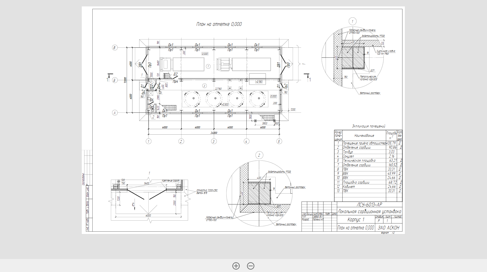

**Pilot.Web.3D** и **Pilot.Web.2D** –- это компоненты для работы с BIM-моделями и документами. 
Они предназначены для решения задач по отображению моделей и документов в браузерах, 
а также взаимодействию с ними пользователей. Например, они позволяют изменять масштаб моделей и документов при их изучении, 
скрывать или измерять отдельные элементы модели, менять их цвет, поворачивать модель при просмотре. 
Компоненты **Pilot.Web.3D** и **Pilot.Web.2D** включают в себя библиотеки JavaScript, стили, методы API и документацию.

#### BIM-модели

В качестве моделей используйте файлы в формате **.bm** - это стандартный формат работы с BIM-моделями в системе Pilot-BIM.

Некоторые инструменты специфичны только для BIM-моделей. Например, для удобства навигации по BIM-модели вы можете использовать **видовой куб**, расположенный в верхней части страницы.

#### Документы

В качестве документов просто используйте файлы в формате .xps (The XML Paper Specification).

Для удобного просмотра документов на панели инструментов есть специальные команды.

<!-- ### Кастомизация вьювера -->

### Требования к браузеру

Для работы с BIM-моделями рекомендуется использовать браузер, совместимый с WebGL-canvas:

- Google Chrome 104+
- Firefox 106+
- Microsoft Edge 104+
- Яндекс.Браузер 22+

Для просмотра XPS-документов рекомендуется использовать браузер:

- Chrome 104+
- Firefox 106+
- Microsoft Edge 104+
- Яндекс.Браузер 22+
