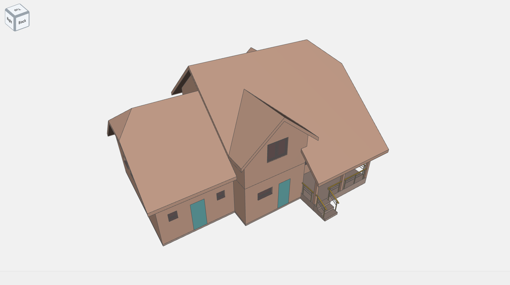

## Обзор

### Что такое PilotWebViewer?

Pilot.Web.3D и Pilot.Web.2D  это JavaScript библиотеки для просмотра 3D моделей и 2D документов. Эти библиотеки позволяют просматривать документы в формате xps и 3D модели созданные в системе Pilot-BIM.

#### 3D Модели

Некоторые инструменты специфичны только для 3D моделей. Так же при просмотре 3D моделей для удобства навигации вы можете использовать **видовой куб**, расположенный в верхней части страницы.

#### 2D Документы

Для просмотра 2D документов (.xps) на панели инструментов присутствуют команды для работы с 3d документами.

<!-- ### Кастомизация вьювера -->
<!-- The Viewer comes with many default settings, the toolbar being just one example. Developers can customize the Viewer’s appearance and behavior with extensions. Check out this sandbox to see a customized version of the Viewer: https://viewer-rocks.autodesk.io/. -->

### Начало работы с вьювером

Для просмотра 2D документов просто используте документы в формате The XML Paper Specification (XPS).
Чтобы начать просматривать 3D модели сначала необходимо получить файлы в формате BM. Стандартный формат работы с 3D моделями в системе Pilot-BIM.

The Model Derivative API enables users to represent and share their designs in different formats. The Viewer communicates natively with the Model Derivative API to fetch model data, complying with its authorization and security requirements. See the Prepare a File for the Viewer tutorial for the Model Derivative API for more information.
Authentication (OAuth) is required in order to use Model Derivative. The Model Derivative tutorial guides you through the process of obtaining an access token. You can also refer to the Authentication Documentation.

### Требования к браузеру

Для просмотра 3D моделей необходимо использовать браузер совместимый с WebGL-canvas:

- Chrome 50+
- Firefox 45+
- Opera 37+
- Safari 9+
- Microsoft Edge 20+

Для просмотра 2D документов необходимо использовать браузер совместимы с SVG:

- Chrome 4+
- Firefox 3+
- Opera 10+
- Safari 3.2+
- Microsoft Edge 79+