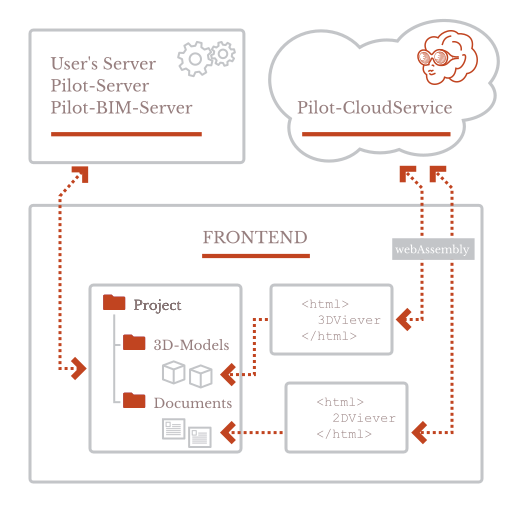

## Установить HUGO
1. В корне диска C создать папку *Hugo (C:\Hugo)*
2. В ней ещё две папки *bin(C:\Hugo\bin)*
3. Скачать дистрибутив https://disk.yandex.ru/d/AoYSYFFfIt3fgg (Другие дистрибутивы и исходный код в папке https://disk.yandex.ru/d/ezhTSU8eqgLEFA)
4. Положить его в *bin*
5. Распаковать в корне *bin*
6. Для Windows 10:
- Правой кнопкой кликнуть на меню **Пуск**
- Выбрать **Система**
- Выбрать **Дополнительные параметры системы**
- На вкладке **Дополнительно** нажать **Переменные среды**
- В части окна **Переменные среды пользователя для ...** выбрать ряд **Path** и нажать кнопку **Изменить**
- В окне **Изменить переменную среды** нажать **Обзор..**. и выбрать директорию, куда был извлечён *hugo.exe*
- В нашем случае *C:\Hugo\bin*
- Везде нажать окей, закрывая окна
7. Проверка:
- Открыть командную строку 
- Напечатать **hugo help**
- Должна подгрузиться в консоли документация

## Рабочий репозиторий
http://vcs.pilot.ascon.net/pilotbim/cloudservicedocs.git

Затянуть к себе в папку, например, *C:\Git\cloudservicedocs*

## Локальная сборка сайта

1. В консоли перейти на папку с содержимым сайта, например, ***C:\Users\volkova_as>cd C:\Git\cloudservicedocs***

2. Собрать сайт командой ***C:\Git\cloudservicedocs>hugo*** или **hugo -D** (соберёт и черновики)

3. Запустить зайт командой **hugo server**

4. Проверить сайт локально по адресу *localhost:1313*

5. Помощь командой **hugo help**

## Папки HUGO
- *archetypes* - используется для создания содержимого сайта на основе заготовок, можно создавать свои собственные архетипы с предварительно настроенными полями основного материала.
- *content* - основное содержимое сайта
- *data* -  используется для хранения файлов конфигурации, которые Hugo может использовать при создании веб-сайта. Можно записать эти файлы в формате YAML, JSON или TOML.
- *layouts* - шаблоны в виде файлов .html, которые определяют, как просмотры вашего контента будут отображаться на статическом веб-сайте.
- *public* - хранит сгенерированные исходники веб-сайта
- *resources* - используется хранения кэша для ускорения сборки сайта
- *static* - хранит статический контент, например, исходники плагина, иконки и т.п.
- *themes* - хранит темы.

## Создание элемента в корне 

Если нужен элемент в корне меню:
1. Кладём в папку Content папку со служебным названием этого элемента, например Element.
2. Создаём в этой папке файл *_index.md*
3. В шапке у него пишем:
```
---
title: "Наш элемент"
date: 2022-08-04T12:44:03+03:00
draft: false
weight: 5
---
```
title - то, что выведется в меню

weight - порядок элемента в меню

4. Если нужна вложенность, то в папке Element создаём файлы .md с разными названиями

## Разметка MD

1. Для перевода строки нужно в теле файла оставлять пустую строку. Недостаточно просто перевести её.
2. Заголовки используют ```#``` и пробел после них. Количество решёток - уровень заголовка, как в HTML - h1, h2, h3
3. Текст

*курсивный текст* - заключается в `*` с каждой стороны

**жирный текст** - заключается в `**` с каждой стороны

***курсивный жирный текст*** - заключается в `***` с каждой стороны

~~зачёркнутый текст~~ - используется своенная тильда `~~` с каждой стороны

4. Цитата

>Так выглядит цитата
>В начале каждой строки
>используется символ &gt;

5. Длинное тире

В текстах используется длинное тире.

`&#8211;` или `--`

&#8211; и --, соответственно

## Вставка ссылки {#reference}

1. `<a href="../ExtensionLoader/">ExtensionLoader</a>`

  Результат: <a href="../ExtensionLoader/">ExtensionLoader</a>

2. `[Help](../oh)`

  Результат: [Help](../oh)

3. Ссылки внутри страницы на подзаголовки:
`## Вставка ссылки {#reference}`\
`[Вставка ссылки](#reference)`

  Результат: [Вставка ссылки](#reference)

4. Межстраничные ссылки на подзаголовки:
`[Вставка ссылки](../oh#reference)`

  Результат: [Вставка ссылки](../oh#reference)

## Вставка кода

**Вариант 1 "Plain code"**

```md
`моноширинный шрифт на сером фоне`
```
Результат:
`моноширинный шрифт на сером фоне`

**Вариант 2 "Забор"**

```md
```html <html><body>код</body></html> ```
```
Результат: 
```html 
<html><body>код</body></html> 
```

**Вариант 3 "highlight"**

 &lt;html>&lt;body>код</body&gt;</html&gt; 

Результат:

<html><body>код</body></html>



**Вариант 4, чтобы показать шорткод**



```md

```

## Плашки


    Текст примечания



    Текст примечания


- hint type="note" icon=gdoc_info_outline title="Примечание"      - голубая    - используется, чтобы записать доп. информацию "в скобках"
- hint type="tip" icon=gdoc_check_circle_outline title="Совет"    - зелёная    - используется, чтобы дать совет, как лучше что-то сделать
- hint type="caution" icon=gdoc_dangerous title="Запрещено"       - фиолетовая - используется в качестве "Внимание, так делать нельзя!"
- hint type="warning" icon=gdoc_fire title="Внимание"             - красная    - используется в качестве "Внимание, нужно делать вот так обязательно, без этого не будет работать"
- hint type="important" icon=gdoc_error_outline title="Важно"     - жёлтая - важная информация, которую надо выделить

## Вставка картинки

**Если картинка лежит прямо рядом со страницей**
```html

```

**Если картинка лежит в папке на одном уровне со страницей**
```html

```

**Картинка с подписью через шорткод**

Для организации страницы, на которой нужны картинки с подписью, нужно сделать следующее:
1. Создать в месте, где должна быть страница, папку, например *Forest-folder*,
2. В эту папку сложить картинку, например, *forests.jpg*,
3. В этой же папке создать файл *_index.md*
4. В шапке описать параметры:

```md
---
title: "Страница с лесной картинкой"
date: 2022-08-04T12:44:03+03:00
draft: false
weight: 10
resources:
  - name: forest-1
    src: "forests.jpg"
    title: Beautiful forest
    params:
      credits: "[Jay Mantri](https://unsplash.com/@jaymantri) on [Unsplash](https://unsplash.com/s/photos/forest)"
---
```
где в resources:

name - переменная, которая передаётся в шорткод, 

src - название файла, 

title - выводится в подпись под картинку,

credits - выводится в подпись под картинку в скобках (рядом с title)

5. Вставить шорткод на страницу (убрав из кода / и *):



## Таблица

 <!-- begin columns block -->
### Левая колонка
Dolor sit, sumo unique argument um no ...

<---> <!-- волшебный разделитель между колонками -->

### Средняя колонка
Dolor sit, sumo unique argument um no ...

<---> <!-- волшебный разделитель между колонками -->

### Правая колонка
Dolor sit, sumo unique argument um no ...



## Шаблоны для версии и даты

Чтобы в документ добавить текущюю версию компонентов нужно указать специальный символ `@VERSION@`

Например:
```js
<link rel="stylesheet" href="https://pilotcloud.ascon.net/components/@VERSION@/pilotweb2d/style.css" type="text/css">
```

В итоге после сборки TeamCity текст будет
```js
<link rel="stylesheet" href="https://pilotcloud.ascon.net/components/1.0.7/pilotweb2d/style.css" type="text/css">
```

*Версия компонентов 1.0.7


Чтобы в документ добавить текущюю дату компонентов нужно указать специальный символ `@DATE@`

Например:
```md
#### Версия 5.0 от @DATE@
```


